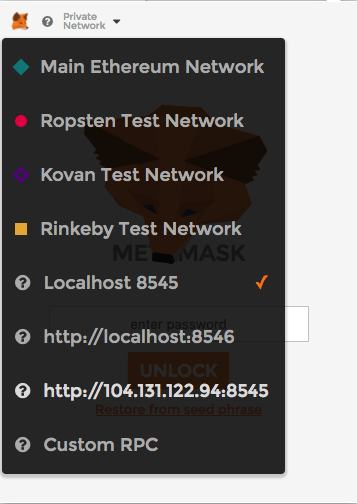

# Connecting to the Oz Ethereum Network without creating your own node

Anyone can connect to the Oz Ethereum Network 

1. Install the [Chrome Metamask Plugin](https://chrome.google.com/webstore/detail/metamask/nkbihfbeogaeaoehlefnkodbefgpgknn?hl=en) , and create a Wallet for yourself
2. Click in the top-right to change Network and choose "Custom RPC" at the bottom
3. Enter **http://104.131.122.94:8555**, press Save and <-

You are now connected to the Oz Ethereum Network!

TODO : add link to home page of Oz Ethereum Enterprise Sandbox

